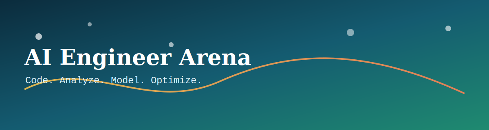

# AI Engineer Arena



[](LICENSE)
[](#supported-languages)
[](#github-pages-plan)
[](CONTRIBUTING.md)
[](https://buy.stripe.com/8x200i8bSgVe3Vl3g8bfO00)
[](https://buy.stripe.com/8x200i8bSgVe3Vl3g8bfO00)

An educational challenge platform for AI/ML-focused software engineers, combining the best of coding interview prep, algorithm competitions, and data science practice.

You progress through **Easy -> Medium -> Hard** tracks, solve coding and shell challenges, and learn through test feedback, performance constraints, and multi-approach editorial solutions.

## Contribute early

Want to help shape the curriculum and platform quality? Start here:

👉 **Contribution guide:** `CONTRIBUTING.md`

## Support this mission

If this platform helps you grow as an engineer, you can directly support new challenges, better editorials, and faster feature delivery.

👉 **Donate here:** https://buy.stripe.com/8x200i8bSgVe3Vl3g8bfO00

What support funds:

- New medium/hard challenge authoring across algorithms, data science, and ML.
- Better hidden-test coverage and stronger anti-bruteforce validation.
- Faster platform improvements (language support, analytics, UX polish).

## Why this project

- Build practical engineering skill depth across software engineering, data science, and machine learning foundations.
- Learn from educational problems with increasing difficulty and clear problem-taxonomy tagging.
- Practice with realistic constraints (correctness, speed, memory) instead of brute-force-only workflows.
- Compare multiple solution styles: baseline, optimized, interview-ready, and advanced research-inspired.

## Core challenge categories

- `algorithms`: strings, arrays, sorting, hash maps, recursion, dynamic programming, graphs, trees
- `data_structures`: linked lists, stacks, queues, heaps, tries, union-find, segment trees
- `data_science`: data cleaning, feature engineering, EDA, metrics, statistical reasoning
- `ml_fundamentals`: classification, regression, model selection, optimization, evaluation
- `shell_lab`: Linux command challenges from single-tool basics to end-to-end pipelines

## Current seed catalog

- 100 starter problems shipped across algorithms, data science, ML fundamentals, and shell lab.
- 76 Python-track problems with runnable public/hidden tests via local runner.
- 24 shell-track problems focused on pipeline-style command fluency.

## Learning and evaluation model

- Progressive difficulty tracks: `easy`, `medium`, `hard`
- Public sample tests for logic validation
- Hidden stress tests for speed, memory, and edge cases
- Problem editorials with multiple approaches and complexity analysis
- Metadata tags for interview recommendation and advanced alternatives
- Local solved-history storage (database integration deferred)
- Recommendation card that suggests your next challenge based on solved history

## Supported languages

### Phase 1

- Python 3.11+

### Planned phases

- C/C++
- R
- Rust
- Go
- Java
- JavaScript
- Julia

## GitHub Pages plan

We are targeting a static frontend hosted on GitHub Pages with:

- problem browsing and filtering
- challenge detail pages
- sample input/output runner experience
- browser Python execution using a free WebAssembly runtime (Pyodide)
- local result summary (pass/fail, runtime, memory approximations where feasible)
- charts for progress and execution stats where browser-safe metrics are available

## Project layout (initial)

```text
.
├── assets/
├── docs/
│   ├── plan/
│   └── specs/
├── problems/
│   ├── algorithms/
│   ├── data_science/
│   ├── ml_fundamentals/
│   └── shell_lab/
├── runner/
├── web/
├── README.md
└── LICENSE
```

## Getting started (initial)

```bash
python3 --version
mkdir -p problems runner web docs/plan docs/specs assets
```

## Runner MVP

Run local checks with public + hidden tests:

```bash
python3 runner/run_problem.py \
  --problem-dir problems/algorithms/two-sum-hash \
  --solution examples/solutions/two_sum_hash.py
```

Run shell challenge public tests:

```bash
python3 runner/run_shell_problem.py \
  --problem-dir problems/shell_lab/log-level-counter \
  --command "cut -d' ' -f2 {input_file} | sort | uniq -c | awk '{print $2, $1}'"
```

Scaffold a new problem quickly:

```bash
python3 scripts/new_problem.py \
  --id sample-problem \
  --title "Sample Problem" \
  --category algorithms \
  --difficulty easy
```

## Web MVP (GitHub Pages-ready static app)

Serve locally:

```bash
python3 -m http.server 8000
```

Then open:

```text
http://localhost:8000/web/
```

Benchmark note:

- Browser runtime stats are labeled `advisory`.
- Local runner can enforce per-test runtime limits and label results as `strict`.

Problem discovery note:

- Users can filter available browser problems by `topic` and `difficulty`.
- Users can search by title/id/tag and browse through paginated results.
- Users can switch curated paths: `Interview Path` and `ML Engineer Path`.
- Keyboard shortcuts: press `/` to focus search, `Esc` to clear search.

Catalog build note:

```bash
python3 scripts/build_web_catalog.py
```

This rebuilds `web/full-catalog.json` from all `problems/**/problem.yaml` metadata.

Quality gate note:

```bash
python3 scripts/score_problem_quality.py --min-score 70 --target-gold 30
```

Tooling shortcuts:

```bash
make help
make validate
make quality
make build-catalog
```

## Deployment

- GitHub Pages is auto-deployed from `main` by `.github/workflows/pages.yml`.
- The workflow publishes the static site from `web/`.
- CI checks run from `.github/workflows/ci.yml` (compile, content contracts, smoke tests).

## Documentation index

- Product and delivery planning: `docs/plan/education-platform-roadmap.md`
- Community cadence: `docs/plan/community-cadence.md`
- Architecture and feature specs: `docs/specs/platform-architecture.md`
- Problem package schema: `docs/specs/problem-pack-contract.md`
- Quality rubric: `docs/specs/problem-quality-rubric.md`
- Backend API contracts: `docs/specs/backend-api-contracts.md`
- Runner usage: `runner/README.md`

## Support this project

If this repository helps you grow as an engineer, please consider supporting maintenance and new challenge development.

- Donate: https://buy.stripe.com/8x200i8bSgVe3Vl3g8bfO00

## License

This project is licensed under the MIT License. See `LICENSE` for details.
